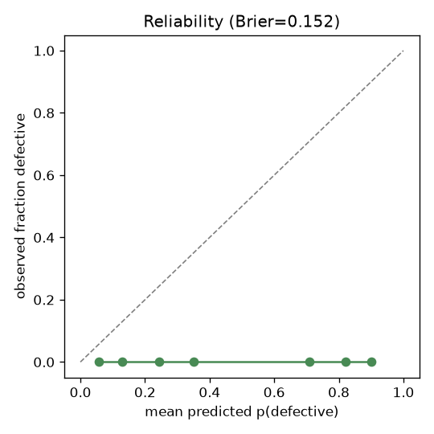
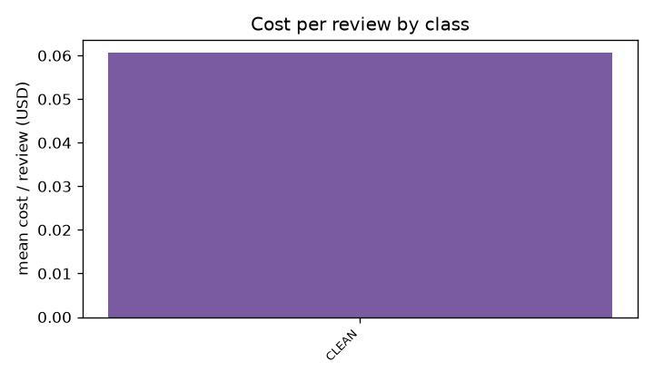

# Verification Gym REPORT

Generated: 2026-07-03T13:54:48.946697+00:00

run_id: `main` · seed: 20260702 · verifier: `claude-opus-4-8` · generator: `claude-opus-4-8` · cumulative spend: $37.38

## MEASURED (computed numbers; §7 pre-specified)

Review items scored (canaries excluded per D14): 30

### Primary 1 — per-class detection rate (95% Wilson CI)

| arm/class | n | detected | missed | misdirected | abstained | detection rate |
|---|---|---|---|---|---|---|

Pooled per arm:

| arm | n | detection rate |
|---|---|---|

### Primary 2 — false-positive rate on CLEAN

n_clean=30, FP=6, rate=20.0% [9.5, 37.3]

### Primary 3 — arm gap at matched class: detection(GEN) − detection(SZZ)

No class has n≥15 in both GEN and SZZ arms; gap not computable for this run.

### Secondary

| class | AUROC (vs CLEAN; D15) |
|---|---|

- Localization precision: — (no flags on defective items)
- Misdirected-flag rate: —
- Brier score: 0.1519
- Abstentions: 0 (0.0%)

Cost per review (mean):

| class | n | tokens_in | tokens_out | latency_ms | USD |
|---|---|---|---|---|---|
| CLEAN | 30 | 10795 | 266 | 5088 | 0.0606 |

### Pipeline self-audit — canary gate (§14.1; excluded from metrics above)

canaries=24, detected=24, rate=100.0%, gate(≥90%): PASS

### Charts

## INFERRED (interpretation; not computed)

_Interpretation is written at Phase 5; nothing inferred for this run._
